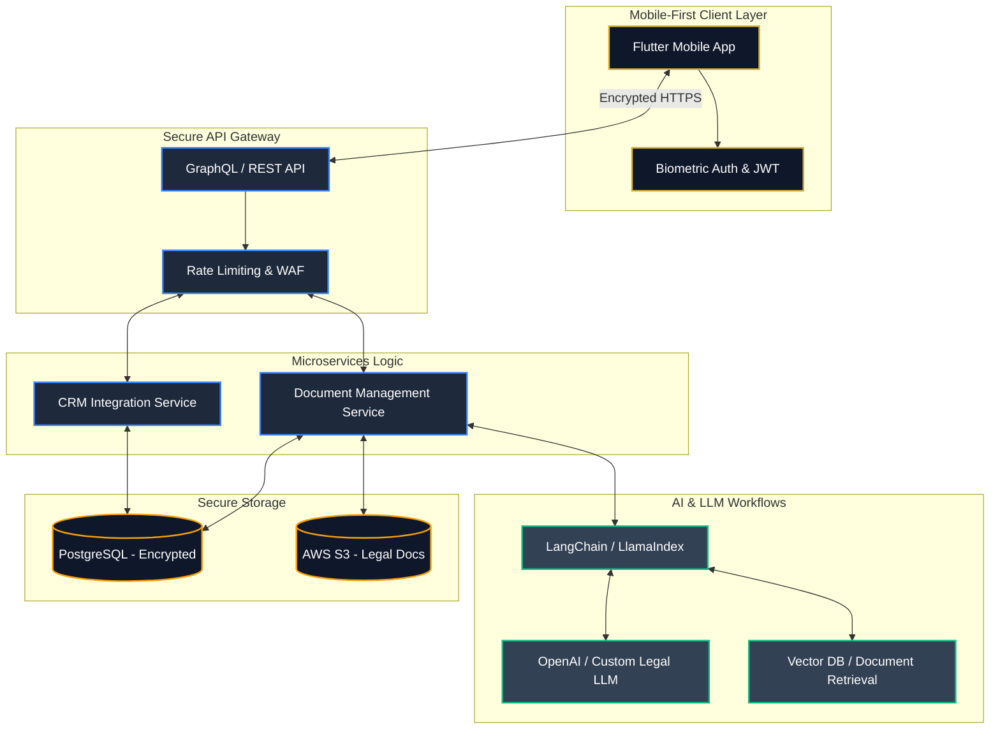

# Proposal Strategy for Unfold Legal AI

Here is the complete pitch package you need to send to Jason Jia. It includes a high-converting email, a 90-day roadmap, and a technical architecture diagram to prove your engineering capabilities.

---

## 1. The Email Pitch (Send this to Jason)

**Subject:** Founding Mobile Engineering for Unfold Legal AI - Architecture & Prototype

**Hi Jason,**

I hope you’re having a great week. 

I saw your posting for a Founding Mobile Development Engineer at Unfold Legal AI and wanted to reach out. As the Founder & Chief Architect at GS3 Solution LLC, my team and I specialize in exactly what you are trying to build: **secure, mobile-first applications powered by complex LLM workflows and AI document automation.**

Instead of just sending a standard resume, we took the liberty of designing a working UI prototype of how your mobile-first legal tech product could look and function. 

**[Insert Link to the Premium Prototype Here]**

Furthermore, we’ve mapped out the technical architecture required to securely integrate your B2B platform's backend with a scalable B2C mobile application. We understand that in legal tech, deploying LLM workflows while maintaining absolute data security (SOC2/HIPAA standards) is paramount.

We would love to jump on a quick 15-minute call to show you the backend architecture model we've designed for Unfold Legal AI and discuss how we can act as your Founding Engineering Team to accelerate your launch.

Are you available for a brief chat this Thursday or Friday?

Best regards,

**Giri Dutta**  
Founder & Chief Architect  
**GS3 Solution LLC**  
[Phone Number] | [LinkedIn Link]

---

## 2. The Technical Architecture (The Brain)

*You can screenshot this diagram or send the text to show you understand the full stack.*

### Architecture Highlights for Jason:
- **Zero-Trust Security:** Mobile app communicates via encrypted GraphQL/REST APIs with strict JWT authentication.
- **RAG (Retrieval-Augmented Generation):** Custom LLM workflows use a Vector Database to accurately parse and query specific legal documents without hallucinations.
- **Scalable Document Storage:** AES-256 encrypted storage for sensitive B2C user data and legal drafts.

---

## 3. The 90-Day Execution Roadmap

*If he asks how long it will take, present this timeline:*

- **Month 1: Foundation & Security**
  - Setup Flutter mobile architecture for iOS and Android.
  - Implement secure Authentication (Biometrics/SSO).
  - Connect mobile frontend to existing B2B backend databases.

- **Month 2: AI & LLM Integration**
  - Deploy LangChain orchestration for document parsing.
  - Implement prompt-based experiences (The Legal Copilot UI).
  - Automate template generation and risk-highlighting features.

- **Month 3: CRM & Polish**
  - Integrate mobile app with Hubspot/Salesforce (or custom CRM).
  - Performance optimization, beta testing, and App Store / Play Store deployment.
